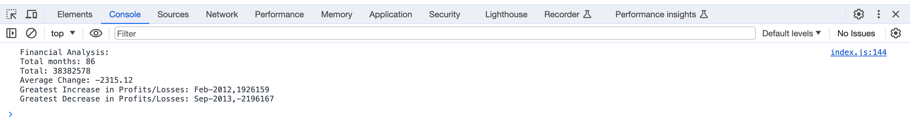
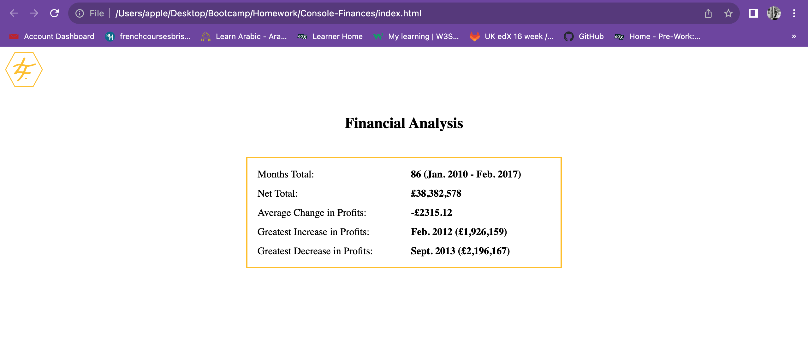

# Console-Finances

## Description

This assignment was to create code for analyzing the financial records of a company, using a financial data set composed of arrays with two fields: Dates and Profit/Losses.

### Tasks completed

* JavaScript code written that analyzes the records to calculate each of the following:
- The total number of months included in the dataset.
- The net total amount of Profit/Losses over the entire period.
- The average of the **changes** in Profit/Losses over the entire period.
- The greatest increase in Profit/Losses (date and amount) over the entire period.
- The greatest decrease in Profit/Losses (date and amount) over the entire period.
* All data logged in console
* All data presented in html application

#### Screenshots

##### Credits

This code was written with some assistance from Corey Yates, tutor at EdX.

###### Links

Deployed website: (https://lianna87.github.io/Console-Finances/)

Code repository:(https://github.com/Lianna87/Console-Finances)

